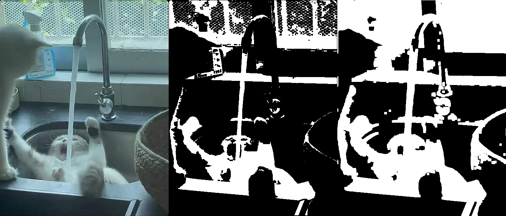

# Overview
This repository contains solutions to various exercises for the **Discrete Modelling** course during the fifth semester at **AGH University of Krakow**. The exercises involve implementing different computational models and simulations in **Python** and **C++**, covering topics such as **image processing**, **cellular automata**, and **fluid simulations**.


*Forest fire simulation with changing wind*

---

# Main Repository Structure
```
Discrete-Modelling/
│── Coursework-Reports/  # Contains reports for exercises
│── Media/               # Media for README.md file
│── ex1/                 # Basic image manipulation (Python)
│── ex2/                 # Image processing with convolution (Python)
│── ex3/                 # Elementary Cellular Automaton (Python)
│── ex4/                 # Game of Life (Python, GIF export)
│── ex5/                 # Forest Fire Simulation (Python, PyGame, Interactive map)
│── ex6/                 # LGA Automaton (C++, SFML/TGUI visualization)
│── ex7/                 # LBM Gas Simulation (C++, extended framework)
│── README.md            # This file
```
---

# Exercises
## Exercise 1: Image Processing
### Overview
Basic image manipulation in Python with the usage of Pillow library:
- **Brightness adjustment**: Modifying image brightness levels.
- **Binarization**: Converting images to black and white based on a threshold.
- **Border Handling**: Managing edges when applying transformations.


*Comparison between initial image and binarized version*

### Directory Structure
```
ex1/  
│── Image/
│   │── Input/          # Initial images
│   └── Output/         # Results
│
│── imgManip.py         # Python source code with image manipulation functions
│── main.py             # Entry point for the program and tasks within this exercise
```

## Exercise 2: Morphological Transformations
### Overview
Further image processing making use of previous functionality and NumPy library:
- **Morphological Transformations**: Applying opening and closing operations to clean up images.
- **Convolution**: Applying kernels for effects like blurring and edge detection.



*Comparison between initial, dilated and eroded image*

### Directory Structure
```
ex2/  
│── Images/
│   │── Input/          # Initial images
│   └── Output/         # Results
│
│── Masks/              # Text files defining kernels for image processing
│── imgManip.py         # Python source code with image manipulation functions
│── main.py             # Entry point for the program and tasks within this exercise
```

## Exercise 3: Elementary Cellular Automaton
### Overview
1D automaton in Python with usage of NumPy and Matplotlib libraries:
- **Border Handling**: Management of edge cases in automaton evolution.
- **Seed Generation**: Initialization of starting patterns.
- **Rule Application**: Implementation of rule sets for evolution.
- **Binary Rule Encoding** – Each rule  is represented as an 8-bit binary number, where each bit corresponds to the output state.
- **Progress Visualization** - Matplotlib graph visualizing the progress of automaton.
- **Output to File** - The progress of the automaton is saved to a .csv file.


*Graph visualizing the progress of the automaton with random seed and rule*

### Directory Structure
```
ex3/  
│── Output/             # Stores automaton progress in .csv format
│── elementaryCa.py     # Python source code with automaton functions
│── main.py             # Entry point for the program and tasks within this exercise
```

## Exercise 4: Conway's Game of Life
### Overview
Implementation of Conway's Game of Life in Python including:
- **Definition of various patterns**.
- **Rule Application** with accordance to Game of Life.
- **Handling of boundary conditions**.
- **Grid-based simulation** of cell evolution.
- **Export of results as GIFs** for visualization.


*GIF visualizing the progress of 2D automaton with random seed*

### Directory Structure
```
ex4/  
│── Output/             # Results of various tasks saved as GIFs
│   │── good_rands/     # Handpicked interesting random results
│
│── GameOfLife.py       # Python source code with automaton functions
│── Main.py             # Entry point for the program and tasks within this exercise
```

## Exercise 5: Forest Fire Simulation
### Overview
A 2D cellular automaton simulating forest fire dynamics in Python with usage of Numpy, Pillow and PyGame libraries including:
- **Image-based map loading**: Real-world images are parsed to initialize the simulation environment.
- **Seven cell states in total**: Dirt, forest, overgrown forest, fire, burned, water, flood.
- **Cell state changes over time**: Forest will grow larger, floods will disappear over time, fire will spread out and burn for a limited time, burned cells will transition into dirt after a while.
- **Real-time environment manipulation**: User can change any cell to any type while the simulation is running or paused.
- **Wind in fire simulation**: The behavior of fire changes drastically based on the wind, which can lead it towards 8 different directions or disabled.
- **Water fighting fire**: For the fire to have a natural and interesting counter, the water will flood the fire, chasing it until it's extinguished.
- **Simulation speed control**: The simulation can be paused, sped up, slowed down or reset. 


*GIF showcasing the progress of a fire with changing wind*

### Directory Structure
```
ex5/  
│── Input/             # Various images interpreted as maps / environments by the code.  
│── Automaton.py       # Python source code handling the various aspects of automaton simulation.  
│── Visualization.py   # Python source code responsible for visualization and control of the automaton.  
│── Main.py            # Entry point for the program, handles the interpretation of an image into a map and creation of both the automaton and visualization.  
```

## Exercise 6: LGA Automaton
### Overview
A complex 2D Lattice Gas Automaton in C++ using SFML and TGUI libraries as well as CUDA framework with the following features:
- **Three cell states**: Air, Gas, Wall.
- **Random seed generation**: Probability of cell being of Gas type inputted by the user.
- **Real-time grid manipulation**: User can modify any cell to be of any type while the simulation is running or paused.
- **Simulation controls**: The simulation can be paused, sped up, slowed down, reset or regenerated.
- **Option to display or hide the grid**.
- **Ability to change the processing unit from CPU to GPU in real-time**: Regrettably, the GPU update method is non-functional in the final version. The reason for this is that every subsequent project required significant changes to the automaton's rule application, which in turn meant that both the CPU and GPU automaton update codes had to be rewritten each time.


*LGA simulation*

### Project Structure
- **Controller**: A class that manages the operation of the entire program, coordinating interactions between other components.
- **Visualization**: Responsible for visualizing the LGA automaton process using the SFML library.
- **UI**: Handles the positioning of the graphical user interface (GUI) using the TGUI library.
- **Automaton**: Implements the sequential model of the LGA cellular automaton.
- **AutomatonCUDA**: Implements the LGA automaton model using the GPU on the CUDA platform.

### Directory Structure
```
ex6/  
│── include/              # Header files (.h) for class and method declarations
│── src/                  # Source files (.cpp), including the main entry point (main.cpp)
│── LGA.sln               # Visual Studio solution file (open this to load the project)
│── LGA.vcxproj           # Visual Studio project file (contains project settings)
│── LGA.vcxproj.filters   # Visual Studio project filters file (organizes files in Solution Explorer)
│── dependencies.zip      # External dependencies (extract here to ensure proper functionality)
```

## Exercise 7: LBM Automaton
### Overview
A complex 2D fluid simulation based on Lattice Boltzmann Method in C++ using SFML and TGUI libraries as well as CUDA framework with the following features:
- **Three cell states**: Air, Fluid, Wall.
- **Simulation of particles**: Positions of particles as well as their trajectories are calculated based on the fluid flow and visualized. 
- **Random seed generation**: Probability of cell being of Fluid type entered by the user.
- **Real-time grid manipulation**: User can modify any cell to be of any type while the simulation is running or paused.
- **Simulation controls**: The simulation can be paused, sped up, slowed down, reset or regenerated.
- **Visual grid options**: Toggleable buttons allow for display of streamlines, grid lines and trajectory of particles.
- **Visualization of velocity**: Additional windows for displaying the velocity on X and Y axes.
- **Ability to change the processing unit from CPU to GPU in real-time**: *Note: GPU functionality was deprecated in later projects due to iterative rule changes*.
- **Cell Debugging**: Inspect real-time data for any cell selected with the mouse, logged to the console each frame.
- **Exporting as images**: The state of the automaton can be saved as a set of 3 images: main grid, X-axis velocity and Y-axis velocity.
- **Saving / Loading of the progress**: The progress of the automaton can be saved into a .csv file. The same file can be loaded to continue the computations in a different session


*LBM simulation*

### Project Structure
- **Controller**: A class that manages the operation of the entire program, coordinating interactions between other components.
- **Visualization**: Responsible for visualizing the LBM automaton process using the SFML library.
- **UI**: Handles the positioning of the graphical user interface (GUI) using the TGUI library.
- **Automaton**: Implements the sequential model of the LBM cellular automaton.
- **AutomatonCUDA**: Implements the LBM automaton model using the GPU on the CUDA platform.

### Directory Structure
```
ex7/  
│── include/              # Header files (.h) for class and method declarations
│── output/               # Simulation outputs (save states in .csv and images in .png)
│── src/                  # Source files (.cpp), including the main entry point (main.cpp)
│── LBM.sln               # Visual Studio solution file (open this to load the project)
│── LBM.vcxproj           # Visual Studio project file (contains project settings)
│── LBM.vcxproj.filters   # Visual Studio project filters file (organizes files in Solution Explorer)
│── dependencies.zip      # External dependencies (extract here to ensure proper functionality)
```

# Installation
- For Python projects only source code and file structures are provided. Libraries are not included.
- Both C++ projects can be easily opened through Visual Studio's 'Clone Repository' feature.
  - Paste the following link as location: https://github.com/Filip-Rak/Discrete-Modelling.
  - Clone the project.
  - Navigate to the desired exercise directory within the project.
  - `dependencies.zip` file **must** be extracted in its exact location in order to avoid build errors. 
  - Navigate through the file structure to a `.sln` file and open it.
  - Now you can run the code from within Visual Studio.
